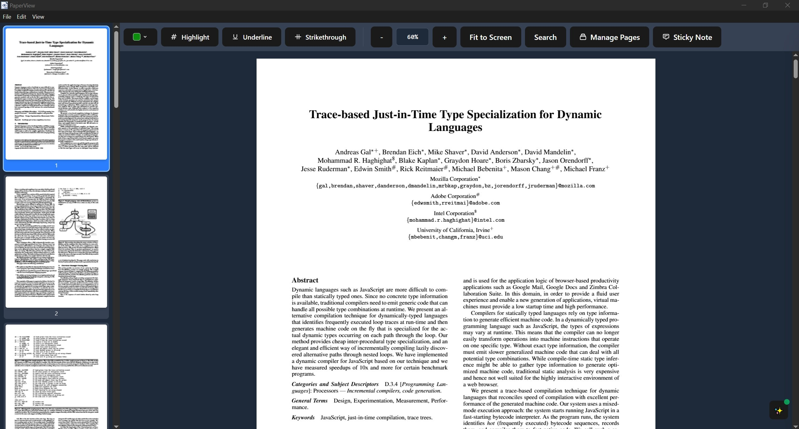

# PaperView

A cross platform PDF viewer built with Electron, React, and TypeScript. PaperView provides a clean interface for viewing and searching through PDF documents.

## Features

- **PDF Viewing**: High quality PDF rendering with smooth scrolling
- **AI Assistant**: Powered by Google Gemini AI for document analysis and Q&A
- **Full-Text Search**: Search through PDF content with highlighted results and context preview
- **Thumbnail Navigation**: Quick page navigation with thumbnail sidebar
- **Zoom Controls**: Zoom in and zoom out with fit to screen
- **Modern UI**: Clean, dark-themed interface built with Tailwind CSS
- **Cross-Platform**: Works on Windows, macOS, and Linux



## Tech Stack

- **Frontend**: React 19 + TypeScript
- **Desktop**: Electron 38
- **PDF Engine**: PDF.js 5.4
- **AI Engine**: Google Gemini API
- **Styling**: Tailwind CSS 4.1
- **Build Tool**: Vite 7

## Getting Started

### Prerequisites

- Node.js 18+ 
- npm or yarn

### Installation

1. **Clone the repository**
   ```bash
   git clone https://github.com/your-username/paperview.git
   cd paperview
   ```

2. **Install dependencies**
   ```bash
   npm install
   ```

3. **Configure AI Assistant (Optional)**
   ```bash
   # Create .env file and add your Gemini API key
   echo "VITE_GEMINI_API_KEY=your_api_key_here" > .env
   ```
   - Get a free API key from [Google AI Studio](https://makersuite.google.com/app/apikey)
   - The AI assistant will be disabled without a valid API key

4. **Start development server**
   ```bash
   npm run dev
   ```

4. **Build for production**
   ```bash
   npm run build
   ```

5. **Build Electron app**
   ```bash
   npm run electron:build
   ```

## Usage

### Opening PDFs
- Click the "Open PDF" button in the toolbar
- Or drag and drop a PDF file into the application

### Navigation
- **Sidebar Thumbnails**: Click any thumbnail to jump to that page
- **Zoom Controls**: Use +/- buttons or fit-to-screen in the toolbar
- **Keyboard Shortcuts**: 
  - `Ctrl/Cmd + F`: Open search overlay
  - `Escape`: Close search overlay

### Search Features
- **Full Text Search**: Enter text in the search box to find all occurrences
- **Navigation**: Use Previous/Next buttons to jump between search results
- **Context Preview**: See surrounding text for each match
- **Page Jump**: Click any search result to navigate directly to that page
